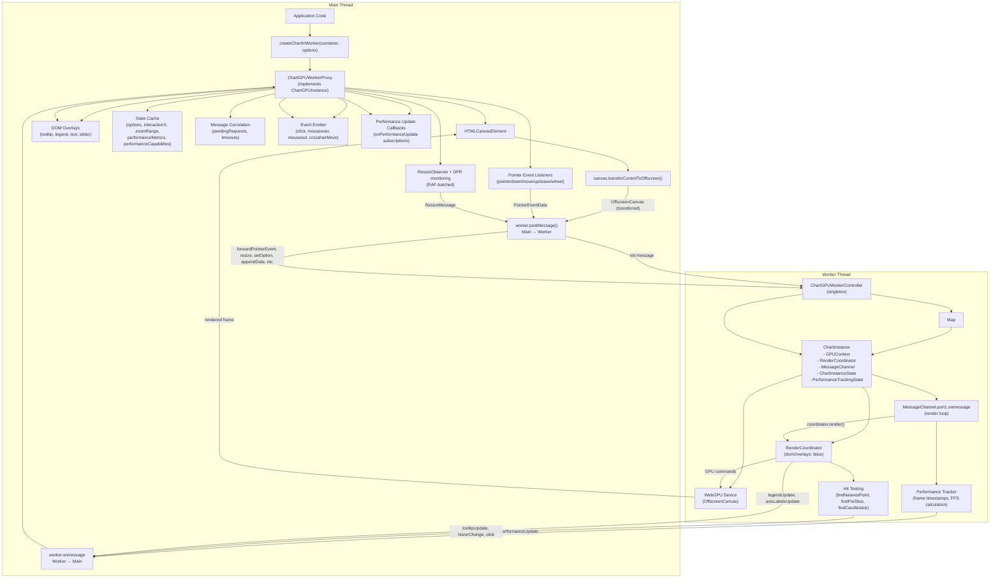

# ChartGPU Worker Thread Architecture

## Overview

ChartGPU's worker thread system offloads GPU rendering to a Web Worker, keeping the main thread responsive during intensive rendering operations. The architecture separates GPU operations (worker thread) from DOM overlays (main thread) using a message-based protocol with OffscreenCanvas.

**Key benefits:**
- Main thread remains responsive during GPU compute and rendering
- Parallel processing of render computations on separate thread
- Clean separation of WebGPU operations from DOM manipulation
- Support for multiple chart instances in a single worker
- Real-time performance monitoring with exact FPS measurement

**Source files:**
- Factory function: [`src/worker/createChartInWorker.ts`](../../src/worker/createChartInWorker.ts)
- Main thread proxy: [`src/worker/ChartGPUWorkerProxy.ts`](../../src/worker/ChartGPUWorkerProxy.ts)
- Worker controller: [`src/worker/ChartGPUWorkerController.ts`](../../src/worker/ChartGPUWorkerController.ts)
- Message protocol: [`src/worker/protocol.ts`](../../src/worker/protocol.ts)
- Worker entrypoint: [`src/worker/worker-entry.ts`](../../src/worker/worker-entry.ts)
- Public exports: [`src/worker/index.ts`](../../src/worker/index.ts)

## Worker Proxy Architecture

### Overview

The worker proxy system provides a transparent ChartGPUInstance interface on the main thread while delegating all rendering to a Web Worker. The proxy manages OffscreenCanvas transfer, message correlation, DOM overlay rendering, and event forwarding.

**Key components:**
1. **createChartInWorker()**: Factory function that creates and initializes worker-based charts
2. **ChartGPUWorkerProxy**: Main thread proxy implementing ChartGPUInstance interface
3. **ChartGPUWorkerController**: Worker-side singleton managing multiple chart instances
4. **Message protocol**: Strongly-typed request/response messages with correlation IDs

### Factory Function: createChartInWorker()

**Signature:**
```typescript
async function createChartInWorker(
  container: HTMLElement,
  options: ChartGPUOptions,
  workerOrUrl?: Worker | string | URL
): Promise<ChartGPUInstance>
```

**Responsibilities:**
- Validate container element
- Create and configure worker (built-in or custom)
- Create ChartGPUWorkerProxy instance
- Initialize proxy and wait for ready message
- Handle initialization errors and cleanup

**Worker creation options:**
1. **Built-in worker (default):** Uses bundled `worker-entry.ts`
2. **Custom worker URL:** Load worker from specified path
3. **Existing worker instance:** Use pre-created worker

**Error handling:**
- Throws `ChartGPUWorkerError` with detailed error codes
- Cleans up resources (worker, canvas) on failure
- 30-second timeout for initialization

**Source:** [`src/worker/createChartInWorker.ts`](../../src/worker/createChartInWorker.ts)

### Main Thread Proxy: ChartGPUWorkerProxy

**Purpose:** Implements ChartGPUInstance interface on main thread while delegating rendering to worker.

**Key responsibilities:**
1. **State caching:** Maintains local copies of options, interactionX, zoomRange, performance metrics for synchronous getters
2. **Message correlation:** Tracks request/response pairs with unique message IDs
3. **Event forwarding:** Captures pointer events and forwards to worker
4. **DOM overlay management:** Renders tooltip, legend, axis labels, data zoom slider
5. **Event re-emission:** Receives worker events and emits to registered listeners
6. **Performance tracking:** Caches and forwards performance metrics from worker, emits performance updates
7. **Lifecycle management:** Handles initialization, resize monitoring, and cleanup with race condition prevention

**Architecture:**

```
ChartGPUWorkerProxy
├── State Cache (synchronous getters)
│   ├── cachedOptions: ChartGPUOptions
│   ├── cachedInteractionX: number | null
│   ├── cachedZoomRange: { start, end } | null
│   ├── cachedPerformanceMetrics: PerformanceMetrics | null
│   └── cachedPerformanceCapabilities: PerformanceCapabilities | null
├── Message Correlation System
│   ├── pendingRequests: Map<messageId, PendingRequest>
│   └── messageTimeout: number (30s default)
├── Event System
│   ├── listeners: Map<eventName, Set<callback>>
│   ├── performanceUpdateCallbacks: Set<callback>
│   └── boundMessageHandler: (MessageEvent) => void
├── Initialization State
│   └── isInitialized: boolean (prevents premature event forwarding)
├── DOM Overlays
│   ├── tooltip: Tooltip | null
│   ├── legend: Legend | null
│   ├── textOverlay: TextOverlay | null
│   ├── dataZoomSlider: DataZoomSlider | null
│   └── zoomState: ZoomState | null
├── Event Forwarding
│   ├── boundEventHandlers: { pointerdown, pointermove, pointerup, pointerleave, wheel }
│   ├── pendingMoveEvent: PointerEvent | null (RAF throttling)
│   └── moveThrottleRafId: number | null
└── Resize Monitoring
    ├── resizeObserver: ResizeObserver | null
    ├── currentDpr: number (device pixel ratio)
    ├── dprMediaQuery: MediaQueryList | null
    ├── pendingResize: { width, height } | null
    └── resizeRafId: number | null
```

**Source:** [`src/worker/ChartGPUWorkerProxy.ts`](../../src/worker/ChartGPUWorkerProxy.ts)

### OffscreenCanvas Transfer

**Process:**
1. **Main thread:** Create HTMLCanvasElement and append to container
2. **Main thread:** Set up event listeners (pointer events, wheel)
3. **Main thread:** Set up ResizeObserver and DPR monitoring
4. **Main thread:** Create DOM overlays (tooltip, legend, text, slider)
5. **Main thread:** Call `canvas.transferControlToOffscreen()`
6. **Main thread:** Send InitMessage with OffscreenCanvas as transferable
7. **Worker thread:** Receive OffscreenCanvas and create WebGPU context
8. **Worker thread:** Send ReadyMessage when initialization complete

**Important:** After transferControlToOffscreen(), the canvas can no longer be accessed from the main thread. All rendering must occur in the worker.

**Source:** See [`ChartGPUWorkerProxy.init()`](../../src/worker/ChartGPUWorkerProxy.ts)

### Message Correlation System

**Purpose:** Track request/response pairs with timeout handling.

**Mechanism:**
1. Generate unique message ID (timestamp + counter)
2. Create Promise and store resolve/reject in pendingRequests map
3. Set up timeout (default 30s) to reject on timeout
4. Send message to worker
5. Worker processes and responds with matching message ID
6. Proxy receives response, looks up pending request, resolves Promise
7. Clear timeout and remove from map

**Benefits:**
- Type-safe request/response pairing
- Automatic timeout handling
- Proper error propagation
- No memory leaks (cleanup on timeout/success)

**Source:** See [`ChartGPUWorkerProxy.sendMessageWithResponse()`](../../src/worker/ChartGPUWorkerProxy.ts)

### DOM Overlay Management

**Purpose:** Render tooltip, legend, axis labels, and data zoom slider on main thread while chart renders in worker.

**Components:**
- **Tooltip:** Hover feedback with data point info (RAF-batched updates)
- **Legend:** Series names and colors (RAF-batched updates)
- **Text overlay:** Axis labels with positioning (RAF-batched updates)
- **Data zoom slider:** Zoom range controls (created if `dataZoom.type === 'slider'`)

**RAF Batching:**
- Multiple overlay updates within a single frame are batched
- Prevents layout thrashing from rapid updates
- Updates applied in single RAF callback
- Improves performance for high-frequency hover events

**Update flow:**
1. Worker emits overlay update message (`tooltipUpdate`, `legendUpdate`, `axisLabelsUpdate`)
2. Proxy receives message and stores in `pendingOverlayUpdates`
3. Proxy schedules RAF callback if not already scheduled
4. RAF callback applies all pending updates in batch
5. Pending updates cleared after application

**Source:** See [`ChartGPUWorkerProxy` overlay methods](../../src/worker/ChartGPUWorkerProxy.ts)

### Event Forwarding to Worker

**Purpose:** Capture pointer events on main thread canvas and forward to worker for interaction handling.

**Event types:**
- **pointerdown:** Click detection and pan start
- **pointermove:** Hover, tooltip updates, pan dragging (RAF-throttled)
- **pointerup:** Click completion and pan end
- **pointerleave:** Clear hover state
- **wheel:** Zoom interactions

**Event serialization with grid coordinate computation:**
- Native PointerEvent and WheelEvent objects cannot be transferred to worker
- Proxy serializes events to plain objects (`PointerEventData`)
- **CRITICAL:** Main thread computes grid coordinates using `computePointerEventData()` before sending to worker
- Extracted fields: clientX, clientY, offsetX, offsetY, gridX, gridY, isInGrid, button, buttons, modifiers, timestamp
- Worker receives pre-computed grid coordinates and uses `interactionScales` for tooltip hit-testing

**Why grid coordinates must be computed on main thread:**
- OffscreenCanvas lacks `getBoundingClientRect()` method (DOM API)
- Canvas dimensions must be calculated from container element on main thread
- `getPlotSizeCssPx()` converts OffscreenCanvas dimensions to CSS pixels using device pixel ratio
- `computeInteractionScalesGridCssPx()` creates scales for domain→grid coordinate mapping

**RAF Throttling for pointermove:**
- Throttles move events to 60fps max
- Stores latest move event in `pendingMoveEvent`
- Schedules RAF if not already scheduled
- RAF callback sends latest event and clears pending
- Prevents message queue overflow on rapid mouse movement

**Source:** See [`ChartGPUWorkerProxy.computePointerEventData()`](../../src/worker/ChartGPUWorkerProxy.ts) and [`ChartGPUWorkerProxy` event forwarding methods](../../src/worker/ChartGPUWorkerProxy.ts)

## Tooltip and Interaction Support

### Overview

Worker-threaded charts support full tooltip and interaction capabilities through a coordinate calculation system that bridges the main thread (DOM access) and worker thread (GPU rendering and hit-testing).

**Key challenge:** OffscreenCanvas does not have DOM-specific properties like `getBoundingClientRect()`, `offsetLeft`, or `offsetTop`, which are required for calculating grid coordinates for tooltip hit-testing.

**Solution:** Split coordinate calculation across threads:
1. **Main thread:** Compute grid coordinates using canvas container dimensions
2. **Worker thread:** Use pre-computed grid coordinates with `interactionScales` for hit-testing

### Coordinate Calculation Flow

```
User Pointer Event (DOM)
  ↓
Main Thread: canvas.getBoundingClientRect()
  ↓
computePointerEventData()
  → Calculate canvas-local coordinates (clientX - rect.left)
  → Calculate grid coordinates using getPlotSizeCssPx() + grid offsets
  → Create PointerEventData with gridX, gridY, isInGrid
  ↓
ForwardPointerEventMessage (postMessage to worker)
  ↓
Worker Thread: ChartGPUWorkerController
  ↓
coordinator.handlePointerEvent(eventData)
  → Uses eventData.gridX, eventData.gridY
  → Performs hit-testing with interactionScales
  → findNearestPoint() / findPointsAtX()
  ↓
TooltipUpdateMessage (postMessage to main thread)
  → Complete tooltip content + position
  ↓
Main Thread: RAF-batched tooltip.show(x, y, content)
```

### OffscreenCanvas Coordinate Calculation

**Problem:**
- OffscreenCanvas has no `getBoundingClientRect()` method (DOM API)
- OffscreenCanvas has no `offsetLeft` or `offsetTop` properties
- Worker thread cannot access canvas container element to measure dimensions

**Solution implemented in `getPlotSizeCssPx()`:**

```typescript
function getPlotSizeCssPx(
  canvas: SupportedCanvas | null,
  devicePixelRatio: number,
  grid: GridArea
): { widthCssPx: number; heightCssPx: number } {
  if (!canvas) return { widthCssPx: 0, heightCssPx: 0 };
  
  if (isHTMLCanvasElement(canvas)) {
    // HTMLCanvasElement: use clientWidth/clientHeight (CSS pixels)
    return {
      widthCssPx: canvas.clientWidth,
      heightCssPx: canvas.clientHeight
    };
  }
  
  // OffscreenCanvas: canvas.width/height are in device pixels
  // Convert to CSS pixels by dividing by device pixel ratio.
  // Robustness: treat missing/invalid DPR as 1.0 (renderers do the same).
  const dpr = Number.isFinite(devicePixelRatio) && devicePixelRatio > 0 ? devicePixelRatio : 1;
  const cssWidth = canvas.width / dpr;
  const cssHeight = canvas.height / dpr;
  
  // Apply grid area constraints to get plot region
  return {
    widthCssPx: cssWidth - grid.left - grid.right,
    heightCssPx: cssHeight - grid.top - grid.bottom
  };
}
```

**Key insight:** OffscreenCanvas dimensions are stored in device pixels, so dividing by DPR converts to CSS pixels (which match DOM coordinate system).

### computeInteractionScalesGridCssPx()

**Purpose:** Create domain→grid coordinate scales for tooltip hit-testing in worker thread.

**Updated implementation** (supports OffscreenCanvas):
- Removed `isHTMLCanvasElement(canvas)` check that blocked worker mode
- Uses `getPlotSizeCssPx()` to get CSS pixel dimensions for both canvas types
- Creates linear scales mapping domain coordinates to grid coordinates
- Returns `null` if canvas is unavailable or the plot (grid) region resolves to a non-positive size. Note: canvas device-pixel dimensions are clamped to at least 1px (so 0-size canvases no longer throw), but grid margins can still produce a degenerate plot area.

**Critical fix:** Previously returned `null` for OffscreenCanvas, causing `interactionScales` to be `null` and breaking all tooltip hit-testing in worker mode.

**Source:** [`src/core/createRenderCoordinator.ts`](../../src/core/createRenderCoordinator.ts)

### Main Thread: computePointerEventData()

**Purpose:** Calculate grid coordinates on main thread before forwarding to worker.

**Implementation in `ChartGPUWorkerProxy`:**

```typescript
private computePointerEventData(event: PointerEvent): PointerEventData {
  const rect = this.canvas.getBoundingClientRect();
  const canvasX = event.clientX - rect.left;
  const canvasY = event.clientY - rect.top;
  
  // Get grid area from cached options
  const grid = this.cachedOptions?.grid || { left: 60, right: 20, top: 40, bottom: 40 };
  
  // Calculate grid-local coordinates
  const gridX = canvasX - grid.left;
  const gridY = canvasY - grid.top;
  
  // Check if pointer is inside grid region
  const canvasCssWidth = this.canvas.clientWidth;
  const canvasCssHeight = this.canvas.clientHeight;
  const gridWidth = canvasCssWidth - grid.left - grid.right;
  const gridHeight = canvasCssHeight - grid.top - grid.bottom;
  const isInGrid = gridX >= 0 && gridX <= gridWidth && gridY >= 0 && gridY <= gridHeight;
  
  return {
    type: event.type as 'pointermove' | 'pointerdown' | 'pointerup' | 'pointerleave',
    clientX: event.clientX,
    clientY: event.clientY,
    offsetX: canvasX,
    offsetY: canvasY,
    gridX,
    gridY,
    isInGrid,
    button: event.button,
    buttons: event.buttons,
    ctrlKey: event.ctrlKey,
    shiftKey: event.shiftKey,
    altKey: event.altKey,
    metaKey: event.metaKey,
    timestamp: event.timeStamp
  };
}
```

**Key features:**
- Uses `getBoundingClientRect()` to get canvas position (only available on main thread)
- Calculates canvas-local coordinates (offsetX, offsetY)
- Calculates grid-local coordinates (gridX, gridY) by subtracting grid offsets
- Determines if pointer is inside grid region (isInGrid flag)
- Implements click detection with 6px/500ms tap candidate thresholds

**Source:** [`src/worker/ChartGPUWorkerProxy.ts`](../../src/worker/ChartGPUWorkerProxy.ts)

### Worker Thread: Hit-Testing with Pre-Computed Coordinates

**Flow in `ChartGPUWorkerController`:**

1. Receive `ForwardPointerEventMessage` with `PointerEventData`
2. Pass `eventData` to `coordinator.handlePointerEvent(eventData)`
3. Coordinator uses `eventData.gridX` and `eventData.gridY` directly
4. `computeInteractionScalesGridCssPx()` creates scales from domain to grid coordinates
5. Hit-testing functions use `interactionScales` to map grid→domain:
   - `findNearestPoint()`: Find closest data point in domain space
   - `findPointsAtX()`: Find all data points at domain x coordinate
   - `findCandlestick()`: Find candlestick at domain x coordinate
   - `findPieSlice()`: Find pie slice at domain angle
6. Worker emits `TooltipUpdateMessage` with complete tooltip content and position
7. Main thread receives message and renders tooltip to DOM (RAF-batched)

**Why this works:**
- Grid coordinates are pre-computed on main thread (has canvas position info)
- Worker receives grid coordinates and uses `interactionScales` for domain mapping
- `interactionScales` is now properly computed for OffscreenCanvas (no longer `null`)
- Hit-testing functions work identically in main-thread and worker-thread charts

**Source:** [`src/worker/ChartGPUWorkerController.ts`](../../src/worker/ChartGPUWorkerController.ts)

### Coordinate System Summary

**Four coordinate systems:**

1. **Client coordinates** (page-global): `event.clientX`, `event.clientY`
   - Absolute position on page
   - Relative to viewport top-left

2. **Canvas coordinates** (canvas-local): `offsetX = clientX - rect.left`, `offsetY = clientY - rect.top`
   - Position within canvas element
   - Origin at canvas top-left corner

3. **Grid coordinates** (plot-local): `gridX = offsetX - grid.left`, `gridY = offsetY - grid.top`
   - Position within plot grid region
   - Origin at grid top-left corner (excludes axes/padding)
   - This is the coordinate system used for hit-testing

4. **Domain coordinates** (data space): Mapped via `interactionScales.x.invert(gridX)`, `interactionScales.y.invert(gridY)`
   - Actual data values (e.g., timestamp, price)
   - Used by hit-testing functions to find nearest data points

**Transformation flow:**
```
Client (page) → Canvas (element) → Grid (plot) → Domain (data)
    rect.left       grid.left       interactionScales.x.invert()
```

### Troubleshooting

**Symptom:** Tooltips don't appear in worker mode.

**Diagnosis:**
- Check if `interactionScales` is `null` in worker (indicates coordinate calculation failure)
- Verify `ForwardPointerEventMessage` includes valid `gridX`, `gridY` fields
- Confirm `PointerEventData.isInGrid` is `true` for events over plot area

**Common causes:**
- Canvas dimensions not yet initialized (wait for `ready` message)
- Grid area misconfigured (negative dimensions)
- Event forwarding started before `isInitialized = true` (race condition)

**Source:** See [Worker Thread Integration Guide](WORKER_THREAD_INTEGRATION.md) for implementation details

### Event Re-emission to Main Thread

**Purpose:** Receive worker event messages and re-emit as ChartGPUInstance events.

**Event types:**
- **click:** Data point click with hit test results
- **mouseover:** Hover entered on data point
- **mouseout:** Hover cleared
- **crosshairMove:** Crosshair position changed

**Synthetic PointerEvent creation:**
- Worker cannot transfer real PointerEvent objects
- Proxy creates synthetic PointerEvent for event payloads
- Synthetic event has correct clientX/clientY based on canvas position
- Marked with `pointerId: -1` to indicate synthetic origin

**Source:** See [`ChartGPUWorkerProxy.emit()`](../../src/worker/ChartGPUWorkerProxy.ts) and event handler methods

### Performance Metrics Tracking

**Purpose:** Track and expose real-time performance metrics from worker thread rendering.

**Metrics tracked:**
- **Exact FPS:** Calculated from circular buffer of frame timestamps (120 frames = 2 seconds)
- **Frame time stats:** Min, max, average, p50, p95, p99 percentiles
- **CPU/GPU timing:** Submit time vs GPU completion time (optional with timestamp-query feature)
- **Memory stats:** Used, peak, and allocated GPU buffer memory
- **Frame drops:** Total drops, consecutive drops, last drop timestamp

**Circular buffer approach:**
- Fixed-size Float64Array (120 entries) for high-precision timestamps
- Ring buffer wraps around when full
- FPS calculated from time delta between oldest and newest timestamps
- More accurate than simple frame-to-frame delta (immune to single-frame spikes)

**Proxy caching:**
- Caches latest `PerformanceMetrics` from worker for synchronous `getPerformanceMetrics()` getter
- Caches `PerformanceCapabilities` from `ReadyMessage` for synchronous `getPerformanceCapabilities()` getter
- Maintains set of `onPerformanceUpdate()` callbacks for streaming updates
- Forwards `PerformanceUpdateMessage` from worker to registered callbacks

**Worker protocol:**
1. Worker tracks frame timestamps in `PerformanceTrackingState` per chart instance
2. Worker calculates metrics after each render (configurable frequency)
3. Worker emits `PerformanceUpdateMessage` to main thread
4. Proxy receives message, updates cache, and notifies callbacks

**GPU timing support:**
- Optional feature requiring `timestamp-query` WebGPU feature
- Can be enabled/disabled via `SetGPUTimingMessage`
- When disabled, `gpuTiming.enabled = false` and times are zero
- When enabled, tracks CPU submit time vs GPU completion time via `queue.onSubmittedWorkDone()`

**Source:** See [`ChartGPUWorkerProxy` performance methods](../../src/worker/ChartGPUWorkerProxy.ts), [`ChartGPUWorkerController.calculatePerformanceMetrics()`](../../src/worker/ChartGPUWorkerController.ts), and [`PerformanceMetrics` types](../../src/config/types.ts)

### ResizeObserver and Device Pixel Ratio Monitoring

**Purpose:** Automatically detect container size changes and device pixel ratio changes, forwarding resize messages to worker.

**ResizeObserver:**
- Monitors canvas element size changes
- Detects window resize, container resize, CSS changes
- RAF-batches resize messages to prevent rapid-fire updates
- Tracks last known dimensions to avoid no-op resizes

**Device Pixel Ratio monitoring:**
- Uses `matchMedia` to detect DPR changes
- Handles window zoom, moving between displays, OS scaling changes
- Updates `currentDpr` and sends resize message on change
- Recreates media query for new DPR after change

**RAF batching:**
- Stores pending resize dimensions
- Schedules RAF if not already scheduled
- RAF callback sends resize message with physical pixel dimensions
- Clears pending resize after sending

**Source:** See [`ChartGPUWorkerProxy` resize monitoring methods](../../src/worker/ChartGPUWorkerProxy.ts)

### Lifecycle and Cleanup

**Initialization:**
1. Create HTMLCanvasElement and append to container
2. Set up event listeners on canvas
3. Set up ResizeObserver and DPR monitoring
4. Create DOM overlays (tooltip, legend, text, slider)
5. Transfer canvas control to OffscreenCanvas
6. Send InitMessage and wait for ReadyMessage
7. Set `isInitialized = true` when ReadyMessage received (prevents premature event forwarding)
8. Cache `performanceCapabilities` from ReadyMessage

**Disposal:**
1. Set `isDisposed = true` to prevent new operations
2. Clean up event listeners and RAF throttling
3. Clean up ResizeObserver and DPR monitoring
4. Dispose DOM overlays and cancel RAF batching
5. Send DisposeMessage to worker
6. Reject all pending requests with disposed error
7. Clear all event listeners
8. Remove worker message handler
9. Remove canvas from container

**Source:** See [`ChartGPUWorkerProxy.init()`](../../src/worker/ChartGPUWorkerProxy.ts) and [`ChartGPUWorkerProxy.dispose()`](../../src/worker/ChartGPUWorkerProxy.ts)

## Public API

The worker-based rendering is exposed through two equivalent APIs:

**Factory function (recommended):**
```typescript
import { createChartInWorker } from 'chartgpu';

const chart = await createChartInWorker(container, options);
// chart implements ChartGPUInstance interface
chart.on('click', (payload) => console.log(payload));
chart.setOption(newOptions);
chart.dispose();
```

**Static method (alternative):**
```typescript
import { ChartGPU } from 'chartgpu';

const chart = await ChartGPU.createInWorker(container, options);
// Identical behavior to createChartInWorker()
```

**Worker options:**
```typescript
// Use built-in worker (default)
const chart = await createChartInWorker(container, options);

// Use custom worker URL
const chart = await createChartInWorker(container, options, './my-worker.js');

// Use existing worker instance
const worker = new Worker('./chart-worker.js', { type: 'module' });
const chart = await createChartInWorker(container, options, worker);
```

**Proxy transparency:**
- `ChartGPUWorkerProxy` implements full `ChartGPUInstance` interface
- All methods, properties, and events work identically to main-thread charts
- Users can switch between main-thread and worker-based rendering without code changes
- Only difference: asynchronous initialization (`await createChartInWorker()`)

**Performance API:**
```typescript
// Get current performance metrics (synchronous)
const metrics: PerformanceMetrics | null = chart.getPerformanceMetrics();
console.log(`FPS: ${metrics.fps}, Frame time: ${metrics.frameTimeStats.avg}ms`);

// Get performance capabilities (synchronous)
const caps: PerformanceCapabilities | null = chart.getPerformanceCapabilities();
console.log(`GPU timing supported: ${caps.gpuTimingSupported}`);

// Subscribe to streaming performance updates
const unsubscribe = chart.onPerformanceUpdate((metrics) => {
  console.log(`Live FPS: ${metrics.fps}`);
});

// Cleanup
unsubscribe();
```

**Performance metrics include:**
- **fps**: Exact FPS from circular buffer (120 frames)
- **frameTimeStats**: Min, max, avg, p50, p95, p99 percentiles (milliseconds)
- **gpuTiming**: CPU submit time vs GPU completion time (optional)
- **memory**: Used, peak, allocated GPU buffer bytes
- **frameDrops**: Total drops, consecutive drops, last drop timestamp
- **totalFrames**: Total frames rendered since initialization
- **elapsedTime**: Total time elapsed (milliseconds)

**Source:** See [`src/worker/index.ts`](../../src/worker/index.ts) for public exports, [`src/config/types.ts`](../../src/config/types.ts) for type definitions

## Why Workers for ChartGPU?

### Main Thread Responsiveness

Traditional canvas rendering blocks the main thread during draw operations. For high-frequency streaming data (e.g., 1000+ points/second), this causes:
- UI freezes and janky scrolling
- Delayed user input response
- Dropped animation frames
- Poor user experience

Worker threads solve this by:
- Moving GPU operations off the main thread
- Processing render requests asynchronously
- Allowing UI interactions to proceed without blocking
- Maintaining 60fps main thread performance

### WebGPU Suitability

WebGPU is particularly well-suited for worker threads:
- OffscreenCanvas provides GPU context in worker
- CommandEncoder/Queue operations are non-blocking
- GPU device can be accessed from any thread
- Render passes submit asynchronously to GPU

### Performance Characteristics

**Main thread rendering:**
- Render time: 1-5ms per frame (blocks main thread)
- UI responsiveness: Degraded during rendering
- Best for: Static charts, infrequent updates

**Worker thread rendering:**
- Message overhead: ~0.1ms per message
- UI responsiveness: Excellent (main thread unblocked)
- Best for: Real-time streaming, high-frequency updates

## Architecture Diagram



## Message Flow

### Initialization Sequence

1. **Main thread:** Call `createChartInWorker(container, options, workerOrUrl?)`
2. **Main thread:** Factory function creates Web Worker (built-in or custom)
3. **Main thread:** Factory function creates `ChartGPUWorkerProxy` instance
4. **Main thread:** Proxy creates HTMLCanvasElement and appends to container
5. **Main thread:** Proxy sets up pointer event listeners on canvas
6. **Main thread:** Proxy sets up ResizeObserver and DPR monitoring
7. **Main thread:** Proxy creates DOM overlays (tooltip, legend, text, slider)
8. **Main thread:** Proxy calls `canvas.transferControlToOffscreen()`
9. **Main thread:** Proxy sends `InitMessage` with OffscreenCanvas (transferred)
10. **Worker thread:** `ChartGPUWorkerController` receives `init` message
11. **Worker thread:** Controller initializes WebGPU context via [`createGPUContext()`](../../src/core/GPUContext.ts)
12. **Worker thread:** Controller creates [`RenderCoordinator`](../../src/core/createRenderCoordinator.ts) with `domOverlays: false`
13. **Worker thread:** Controller sets up MessageChannel for render scheduling
14. **Worker thread:** Controller initializes performance tracking state (frame timestamps, counters)
15. **Worker thread:** Controller emits `ReadyMessage` to main thread with matching `messageId`, `performanceCapabilities`, and `initialZoomRange`
16. **Main thread:** Proxy receives `ready` message, caches `performanceCapabilities`, caches `initialZoomRange` for slider initialization, sets `isInitialized = true`, and resolves `init()` Promise
17. **Main thread:** Factory function returns initialized proxy to application code

**Race condition prevention:**
- **Event forwarding:** The `isInitialized` flag prevents events from being forwarded to the worker before initialization completes. Events received before `ReadyMessage` are silently dropped, preventing worker errors.
- **Zoom slider initialization:** The `initialZoomRange` field in `ReadyMessage` ensures the zoom slider initializes with the correct zoom range synchronously. Without this field, the slider would initialize with default `[0, 100]` range before receiving the first `zoomChange` message from the worker, causing a visual flicker and incorrect initial state. The worker computes the initial zoom range based on `dataZoom` configuration during coordinator creation and includes it in the ready message. See [`src/worker/protocol.ts`](../../src/worker/protocol.ts) and [`src/worker/ChartGPUWorkerController.ts`](../../src/worker/ChartGPUWorkerController.ts).

**Source:** See [`createChartInWorker()`](../../src/worker/createChartInWorker.ts), [`ChartGPUWorkerProxy.init()`](../../src/worker/ChartGPUWorkerProxy.ts), and [`ChartGPUWorkerController.initChart()`](../../src/worker/ChartGPUWorkerController.ts)

### Configuration and Data Updates

**Pattern:** Application calls proxy methods → proxy sends messages to worker → worker applies changes and requests render

**Common operations:**
1. **setOption(options):**
   - Proxy updates `cachedOptions` for synchronous getter
   - Proxy sends `SetOptionMessage` to worker
   - Worker calls `coordinator.setOptions()` which triggers `onRequestRender()` callback
   - Callback posts to MessageChannel, scheduling render
   
2. **appendData(seriesIndex, points):**
   - Proxy serializes data points to ArrayBuffer
   - Proxy sends `AppendDataMessage` with transferred ArrayBuffer
   - Worker deserializes data and calls `coordinator.appendData()`
   - Data append triggers `onRequestRender()` callback

3. **resize():**
   - Proxy measures canvas dimensions and device pixel ratio
   - Proxy sends `ResizeMessage` with physical pixel dimensions
   - Worker reconfigures canvas and WebGPU context
   - Renders immediately after resize

**Automatic operations:**
- **ResizeObserver:** Detects container size changes and sends resize messages (RAF-batched)
- **DPR monitoring:** Detects device pixel ratio changes and sends resize messages

**Source:** See [`ChartGPUWorkerProxy` methods](../../src/worker/ChartGPUWorkerProxy.ts), [`ChartGPUWorkerController.handleSetOption()`](../../src/worker/ChartGPUWorkerController.ts), and [`ChartGPUWorkerController.handleAppendData()`](../../src/worker/ChartGPUWorkerController.ts)

### Interaction Flow

**Pattern:** Proxy captures DOM events, serializes to PointerEventData, forwards to worker

1. **Main thread:** Pointer event fires on canvas (pointerdown/move/up/leave/wheel)
2. **Main thread:** Proxy event handler receives native PointerEvent
3. **Main thread:** Proxy serializes event to plain object (PointerEventData)
   - Extracts: clientX, clientY, offsetX, offsetY, button, buttons, modifiers, timestamp
   - For wheel events: adds deltaX, deltaY, deltaZ, deltaMode
4. **Main thread:** Proxy sends `ForwardPointerEventMessage` to worker
   - pointermove events are RAF-throttled to 60fps
5. **Worker thread:** `ChartGPUWorkerController` receives `forwardPointerEvent` message
6. **Worker thread:** Controller passes PointerEventData to `coordinator.handlePointerEvent()`
7. **Worker thread:** Coordinator performs hit testing and updates interaction state
8. **Worker thread:** Coordinator emits interaction messages via callbacks:
   - `tooltipUpdate`: Tooltip content and position (triggers `onTooltipUpdate`)
   - `hoverChange`: Hover state changed (derived from tooltip data in `onTooltipUpdate`)
   - `click`: Click with hit test results (triggers `onClickData`)
   - `crosshairMove`: Crosshair position (triggers `onCrosshairMove`)
9. **Main thread:** Proxy receives messages in `handleWorkerMessage()`
10. **Main thread:** Proxy routes messages to appropriate handlers:
    - `tooltipUpdate` → RAF-batch and update tooltip DOM
    - `hoverChange` → Re-emit 'mouseover'/'mouseout' events
    - `click` → Re-emit 'click' event with synthetic PointerEvent
    - `crosshairMove` → Update cached interactionX and re-emit event

**Source:** See [`ChartGPUWorkerProxy` event forwarding methods](../../src/worker/ChartGPUWorkerProxy.ts), [`ChartGPUWorkerController.handlePointerEvent()`](../../src/worker/ChartGPUWorkerController.ts), and [INTERNALS.md - Worker Thread Support](../api/INTERNALS.md#worker-thread-support--dom-overlay-separation)

### DOM Overlay Updates

**Pattern:** Worker computes overlay data, proxy receives messages, RAF-batches updates to DOM

**Overlay types:**
- **Tooltip:** Hover feedback with data point info (RAF-batched)
- **Legend:** Series names and colors (RAF-batched)
- **Axis labels:** Tick values and axis titles (RAF-batched)
- **Data zoom slider:** Zoom range controls (synchronized with worker zoom state)

**Update triggers:**
- Tooltip: Pointer movement, hover state changes
- Legend: Series configuration changes, theme changes
- Axis labels: Zoom/pan, data updates, axis config changes
- Data zoom slider: User interaction, programmatic zoom

**RAF batching flow:**
1. Worker emits overlay update message (`tooltipUpdate`, `legendUpdate`, `axisLabelsUpdate`)
2. Proxy receives message in `handleWorkerMessage()`
3. Proxy stores update in `pendingOverlayUpdates` object
4. Proxy schedules RAF callback if not already scheduled
5. RAF callback applies all pending updates in single batch
6. Updates cleared after application

**Benefits of RAF batching:**
- Prevents layout thrashing from rapid updates
- Coalesces multiple updates within a single frame
- Improves performance for high-frequency hover events
- Maintains 60fps DOM rendering

**Callback implementation:**
- Worker: RenderCoordinator callbacks emit messages via `ChartGPUWorkerController.emit()`
- Main thread: Proxy receives messages and RAF-batches DOM updates

**Source:** See [`ChartGPUWorkerProxy` overlay methods](../../src/worker/ChartGPUWorkerProxy.ts), [RenderCoordinatorCallbacks](../api/INTERNALS.md#rendercoordinatorcallbacks), and [INTERNALS.md - Worker Thread Support](../api/INTERNALS.md#worker-thread-support--dom-overlay-separation)

## Render Scheduling with MessageChannel

### Why MessageChannel Instead of requestAnimationFrame?

Workers don't have access to `requestAnimationFrame()` (DOM API). ChartGPU uses **MessageChannel** for render scheduling instead:

**MessageChannel benefits:**
- Available in worker context (no DOM dependency)
- Event-driven scheduling (trigger render on demand)
- Coalesces multiple render requests automatically
- No timing issues with RAF synchronization

**Pattern:**
1. Configuration/data changes trigger `onRequestRender()` callback
2. Callback checks if render is already pending
3. If not pending, set `renderPending = true` and post message to MessageChannel
4. MessageChannel.port1.onmessage handler receives message
5. Handler resets `renderPending = false` and calls `coordinator.render()`
6. Render executes GPU operations and submits command buffer

**Source:** See [`ChartGPUWorkerController.initChart()`](../../src/worker/ChartGPUWorkerController.ts) lines 286-289 (callback) and lines 444-461 (render loop)

### Render Coalescing

**Problem:** Multiple rapid updates (e.g., batch data append + resize + theme change) should render once, not three times.

**Solution:** `renderPending` flag in `ChartInstanceState`

**Mechanism:**
1. First update sets `renderPending = true` and posts to MessageChannel
2. Subsequent updates check `renderPending` and skip posting if true
3. MessageChannel ensures only one message is processed at a time
4. Render resets `renderPending = false` after completion
5. Next update can schedule new render

**Performance benefit:** Eliminates redundant render passes, critical for high-frequency updates

**Source:** See [`ChartGPUWorkerController.initChart()`](../../src/worker/ChartGPUWorkerController.ts) onRequestRender callback

### Render Loop Protection

**Critical checks before render:**
1. **Disposed check:** Skip if `state.disposed === true`
2. **Device lost check:** Skip if `state.deviceLost === true`
3. **Try-catch:** Catch render errors and emit `error` message

**Source:** See [`ChartGPUWorkerController.initChart()`](../../src/worker/ChartGPUWorkerController.ts) render loop handler

## Device Loss Handling Strategy

### Why Device Loss Occurs

GPU devices can be lost due to:
- Driver crashes or timeouts
- GPU removed/reset (laptop dock/undock)
- System power management
- Explicit `device.destroy()` calls
- Out-of-memory conditions

**Impact:** All GPU resources become invalid, rendering stops

### Detection and Monitoring

**Two monitoring points:**

1. **Early monitoring (initialization):** Set up `device.lost` promise listener immediately after `initializeGPUContext()`
   - Catches device loss during coordinator creation
   - Emits `deviceLost` message with initialization context

2. **Runtime monitoring (coordinator):** Coordinator sets up `device.lost` listener in `onDeviceLost` callback
   - Catches device loss during normal operation
   - Emits `deviceLost` message via callback

**Source:** See [`ChartGPUWorkerController.initChart()`](../../src/worker/ChartGPUWorkerController.ts) lines 238-249 (early) and lines 413-421 (coordinator callback)

### State Tracking

**ChartInstanceState.deviceLost flag:**
- Set to `true` when device loss detected
- Checked before all GPU operations (resize, render, data upload)
- Prevents operations on lost devices (throws clear errors)

**Render loop behavior:**
- Checks `deviceLost` flag before rendering
- Silently skips render if device lost
- Resets `renderPending` flag to prevent queue buildup

**Source:** See [`ChartGPUWorkerController.initChart()`](../../src/worker/ChartGPUWorkerController.ts) render loop handler

### Recovery Strategy

**Current behavior:** No automatic recovery

**Rationale:**
- Device loss is rare in production
- Recovery requires complete state reconstruction
- Main thread is better positioned to handle recovery (has application state)

**Recommended recovery pattern (main thread):**
1. Listen for `deviceLost` message
2. Display user notification
3. Terminate worker via `worker.terminate()`
4. Recreate worker and reinitialize chart
5. Restore data and configuration from application state

**Source:** See [worker-protocol.md - Device Loss Handling](../api/worker-protocol.md#device-loss-handling)

### Error Handling

**GPU validation errors:** Captured via `device.addEventListener('uncapturederror')`
- Distinguishes validation errors vs. out-of-memory errors
- Emits detailed error message to main thread
- Continues operation (validation errors are warnings in WebGPU)

**Source:** See [`ChartGPUWorkerController.initChart()`](../../src/worker/ChartGPUWorkerController.ts) lines 251-259

## Multi-Chart Support in Single Worker

### Architecture

**Single worker, multiple chart instances:**
- One `ChartGPUWorkerController` singleton per worker
- Controller manages `Map<chartId, ChartInstance>`
- Each instance has independent GPU context, coordinator, and render channel

**Benefits:**
- Reduced worker overhead (one worker thread, not N threads)
- Shared GPU device across charts (better resource utilization)
- Simplified lifecycle management

**Source:** See [`ChartGPUWorkerController`](../../src/worker/ChartGPUWorkerController.ts) class definition

### Chart Instance Isolation

**ChartInstance structure:**
- `chartId`: Unique identifier (provided by main thread)
- `gpuContext`: [`GPUContextState`](../../src/core/GPUContext.ts) (independent GPU device)
- `coordinator`: [`RenderCoordinator`](../../src/core/createRenderCoordinator.ts) (independent render state)
- `canvas`: `OffscreenCanvas` (transferred from main thread)
- `renderChannel`: `MessageChannel` (independent render loop)
- `state`: `ChartInstanceState` (disposed, deviceLost, renderPending flags)

**Independence guarantees:**
- Each chart has separate GPU device (device loss affects only one chart)
- Each chart has separate render channel (no render interference)
- Each chart has separate state (dispose/device loss tracked independently)

**Source:** See [`ChartInstance`](../../src/worker/ChartGPUWorkerController.ts) interface

### Message Routing

**Pattern:** All messages include `chartId` field

**Routing mechanism:**
1. Worker receives message via `onmessage`
2. `ChartGPUWorkerController.handleMessage()` extracts `chartId`
3. Controller looks up instance in map via `getChartInstance(chartId)`
4. Handler performs operation on specific instance
5. Emitted messages include `chartId` for main thread routing

**Error handling:**
- Chart not found: Emit error message with `chartId`
- Chart disposed: Emit error message with clear description
- Chart device lost: Emit error message suggesting re-initialization

**Source:** See [`ChartGPUWorkerController.handleMessage()`](../../src/worker/ChartGPUWorkerController.ts) and [`ChartGPUWorkerController.getChartInstance()`](../../src/worker/ChartGPUWorkerController.ts)

### Resource Isolation

**Per-chart GPU resources:**
- GPU device (created per-chart via `createGPUContext()`)
- Render pipelines (created per-series in coordinator)
- GPU buffers (created per-series in data store)
- Command encoders/queues (per-device)

**Cleanup isolation:**
- `dispose(chartId)`: Cleans up only specified chart
- Other charts continue operating
- No shared state between chart instances

**Source:** See [`ChartGPUWorkerController.disposeChart()`](../../src/worker/ChartGPUWorkerController.ts)

## Resource Lifecycle and Cleanup

### Initialization Phase

**Resource creation order:**

**Main thread (ChartGPUWorkerProxy):**
1. **Web Worker:** Created from built-in or custom URL
2. **HTMLCanvasElement:** Created and appended to container
3. **Event listeners:** Pointer and wheel event handlers attached to canvas
4. **ResizeObserver:** Set up to monitor container size changes
5. **DPR monitoring:** MediaQueryList set up to detect device pixel ratio changes
6. **DOM overlays:** Tooltip, legend, text overlay, and optional data zoom slider created
7. **OffscreenCanvas:** Created via `canvas.transferControlToOffscreen()`
8. **InitMessage:** Sent to worker with OffscreenCanvas transfer

**Worker thread (ChartGPUWorkerController):**
9. **GPUContext:** Created via [`createGPUContext()`](../../src/core/GPUContext.ts) and initialized via [`initializeGPUContext()`](../../src/core/GPUContext.ts)
10. **MessageChannel:** Created for render scheduling
11. **RenderCoordinator:** Created with GPU context and worker-mode callbacks
12. **DataStore:** Created internally by coordinator for GPU buffer management
13. **Renderers:** Created per-series by coordinator
14. **ReadyMessage:** Emitted to main thread with matching messageId

**Error handling:** 
- If worker initialization fails, MessageChannel is closed and error message emitted
- If proxy initialization fails, proxy is disposed and resources cleaned up
- Factory function re-throws errors for application handling

**Source:** See [`createChartInWorker()`](../../src/worker/createChartInWorker.ts), [`ChartGPUWorkerProxy.init()`](../../src/worker/ChartGPUWorkerProxy.ts), and [`ChartGPUWorkerController.initChart()`](../../src/worker/ChartGPUWorkerController.ts)

### Runtime Phase

**Resource lifetime:**
- GPU buffers managed by [`createDataStore()`](../../src/data/createDataStore.ts)
- Buffers grow geometrically on data updates
- Renderers persist until series configuration changes
- GPU device remains active until dispose or device loss

**Source:** See [INTERNALS.md - GPU buffer streaming](../api/INTERNALS.md#gpu-buffer-streaming-internal--contributor-notes)

### Cleanup Phase

**Resource destruction order:**

**Main thread (ChartGPUWorkerProxy):**
1. **Mark disposed:** Set `isDisposed = true` (prevents new operations)
2. **Clean up event listeners:** Remove pointer and wheel event handlers from canvas
3. **Clean up RAF throttling:** Cancel pending RAF for pointermove events
4. **Clean up resize monitoring:** Disconnect ResizeObserver, cancel pending RAF
5. **Clean up DPR monitoring:** Remove MediaQueryList listener
6. **Dispose DOM overlays:** Destroy tooltip, legend, text overlay, data zoom slider
7. **Cancel RAF batching:** Cancel pending RAF for overlay updates
8. **Send DisposeMessage:** Notify worker to clean up chart instance
9. **Reject pending requests:** Clear all pending message correlation requests
10. **Clear event listeners:** Remove all registered event callbacks
11. **Remove worker handler:** Remove worker message event listener
12. **Remove canvas:** Remove canvas element from container

**Worker thread (ChartGPUWorkerController):**
13. **Mark disposed:** Set `state.disposed = true` (prevents new operations)
14. **Close MessageChannel:** Close both ports to stop render loop
15. **Dispose coordinator:** Calls `coordinator.dispose()`
    - Destroys all GPU buffers via `dataStore.dispose()`
    - Destroys all renderer pipelines
    - Cleans up interaction state
16. **Destroy GPU context:** Calls [`destroyGPUContext()`](../../src/core/GPUContext.ts)
    - Calls `device.destroy()` with error handling
    - Resets context state
17. **Remove from registry:** Delete from `charts` map
18. **Emit disposed message:** Notify main thread with any cleanup errors

**Best-effort cleanup:** Non-fatal errors are collected and reported in `disposed` message

**Source:** See [`ChartGPUWorkerProxy.dispose()`](../../src/worker/ChartGPUWorkerProxy.ts) and [`ChartGPUWorkerController.disposeChart()`](../../src/worker/ChartGPUWorkerController.ts)

### Memory Leak Prevention

**Critical cleanup patterns:**

**Main thread (ChartGPUWorkerProxy):**
- Remove all event listeners from canvas (prevents handler retention)
- Cancel all RAF callbacks (prevents queued function retention)
- Disconnect ResizeObserver (prevents observer retention)
- Remove MediaQueryList listener (prevents listener retention)
- Dispose all DOM overlays (removes DOM elements and event handlers)
- Clear pending requests map (prevents promise retention)
- Clear event listeners map (prevents callback retention)
- Remove worker message handler (prevents handler retention)
- Remove canvas from DOM (prevents element retention)

**Worker thread (ChartGPUWorkerController):**
- Close MessageChannel ports (prevents event listener leaks)
- Destroy GPU buffers (prevents GPU memory leaks)
- Call `device.destroy()` (releases GPU resources)
- Remove chart from map (prevents memory retention)

**Double-dispose protection:** Attempting to dispose an already-disposed chart is a no-op (silent for proxy, error message for worker)

**Source:** See [`ChartGPUWorkerProxy.dispose()`](../../src/worker/ChartGPUWorkerProxy.ts) and [`ChartGPUWorkerController.disposeChart()`](../../src/worker/ChartGPUWorkerController.ts)

## Error Handling Strategy

### Error Categories

| Error Code | Description | Recovery Strategy |
|------------|-------------|-------------------|
| `WEBGPU_INIT_FAILED` | WebGPU adapter/device request failed | Check browser support, show fallback UI |
| `DEVICE_LOST` | GPU device lost during operation | Terminate and recreate worker |
| `RENDER_ERROR` | Error during render pass | Log error, check GPU state, consider restart |
| `DATA_ERROR` | Data processing or buffer operation failed | Validate data format and retry |
| `UNKNOWN` | Unclassified error | Log error, consider worker restart |

**Source:** See [`ErrorMessage`](../../src/worker/protocol.ts) type definition

### Error Message Structure

**All errors include:**
- `chartId`: Affected chart identifier
- `code`: Error category for programmatic handling
- `message`: Human-readable description
- `operation`: Operation that failed (e.g., 'init', 'render', 'appendData')
- `stack`: Optional stack trace for debugging
- `messageId`: Optional ID to correlate with specific request

**Source:** See [`ChartGPUWorkerController.emitError()`](../../src/worker/ChartGPUWorkerController.ts)

### Error Handling Patterns

**Validation errors:** Thrown synchronously with descriptive messages
- Parameter validation (seriesIndex, pointCount, dimensions, etc.)
- Buffer size validation (stride, byte length)
- Zoom range validation (bounds, ordering)

**Runtime errors:** Caught and emitted as error messages
- Render errors caught in render loop handler
- Device loss detected via promise and callbacks
- GPU validation errors captured via `uncapturederror` listener

**Cleanup errors:** Collected but don't fail dispose operation
- Best-effort cleanup continues even if individual steps fail
- Errors reported in `disposed` message `cleanupErrors` array

**Source:** See [`ChartGPUWorkerController`](../../src/worker/ChartGPUWorkerController.ts) error handling throughout

## Performance Optimizations

### RAF Batching for DOM Overlays (Main Thread)

**Problem:** Rapid worker messages (tooltipUpdate, legendUpdate, axisLabelsUpdate) cause layout thrashing

**Solution:** Batch DOM updates in single RAF callback

**Mechanism:**
- Store incoming overlay updates in `pendingOverlayUpdates` object
- Schedule RAF callback if not already scheduled
- RAF callback applies all pending updates in single batch
- Clear pending updates after application

**Benefits:**
- Prevents layout thrashing from multiple DOM reads/writes
- Coalesces updates within a single frame
- Maintains 60fps DOM rendering performance

**Source:** See [`ChartGPUWorkerProxy` overlay methods](../../src/worker/ChartGPUWorkerProxy.ts)

### RAF Throttling for Pointermove Events (Main Thread)

**Problem:** Rapid pointermove events overwhelm worker message queue

**Solution:** Throttle pointermove forwarding to 60fps via RAF

**Mechanism:**
- Store latest pointermove event in `pendingMoveEvent`
- Schedule RAF callback if not already scheduled
- RAF callback sends latest event and clears pending
- Subsequent move events update `pendingMoveEvent` without scheduling

**Benefits:**
- Limits message rate to 60fps max
- Prevents message queue overflow
- Reduces worker processing overhead

**Source:** See [`ChartGPUWorkerProxy` event forwarding methods](../../src/worker/ChartGPUWorkerProxy.ts)

### RAF Batching for Resize Messages (Main Thread)

**Problem:** Rapid resize events (window drag-resize) flood worker with resize messages

**Solution:** Batch resize messages via RAF

**Mechanism:**
- ResizeObserver callback stores pending dimensions
- Schedule RAF if not already scheduled
- RAF callback sends resize message with latest dimensions
- Clear pending resize after sending

**Benefits:**
- Coalesces rapid resize events during window drag
- Prevents message queue overflow
- Worker processes only final dimensions

**Source:** See [`ChartGPUWorkerProxy` resize monitoring methods](../../src/worker/ChartGPUWorkerProxy.ts)

### Shared State Closures (Worker Thread)

**Problem:** Map lookups in hot paths (onRequestRender called on every data update at 60fps)

**Solution:** Capture `ChartInstanceState` in coordinator callbacks

**Benefit:** Eliminates Map lookup overhead in render request and render loop

**Source:** See [`ChartGPUWorkerController.initChart()`](../../src/worker/ChartGPUWorkerController.ts) onRequestRender callback and render loop

### Cached Render Loop References (Worker Thread)

**Problem:** Render loop executes 60 times per second, Map lookup is overhead

**Solution:** Cache `coordinator` and `state` references in render loop closure

**Benefit:** Render loop has zero Map lookup overhead

**Source:** See [`ChartGPUWorkerController.initChart()`](../../src/worker/ChartGPUWorkerController.ts) render loop setup

### Optimized Data Deserialization (Worker Thread)

**Performance-critical path:** `deserializeDataPoints()` called on every data append

**Optimizations:**
- Pre-allocate arrays to exact size (no dynamic resizing)
- Use indexed assignment instead of `push()` (faster)
- Validate inputs early (fail fast)
- Unroll offset calculation in loop increment

**Source:** See [`deserializeDataPoints()`](../../src/worker/ChartGPUWorkerController.ts)

### Zero-Copy Data Transfer

**Pattern:** Transfer ArrayBuffer ownership to worker

**Benefits:**
- No serialization/deserialization overhead
- No memory copying between threads
- Instantaneous "transfer" (just ownership change)

**Usage:** `appendData` and `appendDataBatch` messages transfer data buffers

**Important:** Main thread cannot access transferred buffers (use separate buffer per message)

**Source:** See [`ChartGPUWorkerProxy.serializeDataPoints()`](../../src/worker/ChartGPUWorkerProxy.ts), [`getTransferables()`](../../src/worker/protocol.ts), and [worker-protocol.md - Transferable Objects](../api/worker-protocol.md#transferable-objects)

### Zero-Copy Data Transfer Implementation

ChartGPU implements zero-copy transfer using `postMessage` with transfer lists and intelligent buffer optimization:

**Main thread** ([ChartGPUWorkerProxy](../../src/worker/ChartGPUWorkerProxy.ts)):

1. **Type detection:** Detects typed arrays in `appendData()`
2. **Precision conversion:** Converts Float64Array to Float32Array (GPU uses Float32 precision)
3. **Zero-copy optimization:**
   - **Optimal path:** If `typedArray.byteOffset === 0` and typed array owns entire buffer, transfer buffer directly (zero-copy)
   - **Subarray path:** If typed array is a view into larger buffer, must `slice()` to create transferable buffer (creates copy)
   - Dev mode warning emitted for subarray views to help developers optimize their data pipelines
4. **Transfer:** Passes buffer in transfer list: `postMessage(msg, [buffer])`

**Worker thread** ([ChartGPUWorkerController](../../src/worker/ChartGPUWorkerController.ts)):

1. **Buffer reception:** Receives transferred ArrayBuffer
2. **Validation:** Validates buffer integrity (alignment, size, detachment)
3. **Deserialization:** Interprets buffer using stride information
4. **GPU upload:** Buffer is ready for GPU upload without copying

**Buffer Formats:**
- **XY data:** `[x0, y0, x1, y1, ...]` as Float32Array (8-byte stride)
- **OHLC data (storage):** `[t0, o0, h0, l0, c0, t1, ...]` as Float32Array (20-byte stride)
  - Storage format optimized for GPU rendering (high/low adjacent for min/max operations)
  - Deserialized to ECharts convention: `[timestamp, open, close, low, high]`

**Buffer Validation:**

The worker performs comprehensive validation to ensure data integrity and prevent WebGPU errors:

1. **Detached buffer detection:** Checks `buffer.byteLength === 0` to detect buffers transferred multiple times
2. **4-byte alignment:** Validates `buffer.byteLength % 4 === 0` (WebGPU requirement for all buffer operations)
3. **Stride alignment:** Validates `stride % 4 === 0` (Float32 data requires 4-byte aligned strides)
4. **Size validation:** Validates `buffer.byteLength === pointCount × stride` to catch serialization errors
5. **Error context:** All validation errors include detailed context (expected vs actual, operation, chartId)

**OHLC Data Reordering:**

OHLC data undergoes format conversion during deserialization:

- **Storage format** (GPU-optimized): `[timestamp, open, high, low, close]`
  - High/low adjacent for efficient GPU min/max operations
- **API format** (ECharts convention): `[timestamp, open, close, low, high]`
  - Reordering applied during `deserializeDataPoints()` for API consistency
  - Prevents data corruption in candlestick charts

**Security Considerations:**

See [protocol.ts](../../src/worker/protocol.ts) for comprehensive security documentation:

- **Message validation:** All inbound messages validate chartId, buffer sizes, and numeric parameters
- **Transfer security:** ArrayBuffers become inaccessible to sender after transfer (prevents double-transfer)
- **Resource exhaustion:** Point count validation prevents excessive memory allocation
- **Type safety:** Branded types (`StrideBytes`) prevent stride/offset confusion at compile time

**Dev Mode Warnings:**
- Large array detection (>10K points without typed arrays)
- Stride mismatch validation
- Detached buffer error detection
- Subarray buffer copy warning (performance optimization hint)

### Batch Operations

**Pattern:** `appendDataBatch` combines multiple series updates in single message

**Benefits:**
- Reduces message overhead (one postMessage instead of N)
- Reduces transferable overhead (one transfer list)
- Coordinator can optimize batch updates

**Source:** See [`ChartGPUWorkerController.handleAppendDataBatch()`](../../src/worker/ChartGPUWorkerController.ts)

### Reduced Branching (Worker Thread)

**Pattern:** Early returns instead of nested conditionals (e.g., click handler)

**Benefit:** Improves branch prediction and reduces instruction pipeline stalls

**Source:** See [`ChartGPUWorkerController.initChart()`](../../src/worker/ChartGPUWorkerController.ts) onClickData callback

## Related Documentation

### Worker API Documentation
- [Worker Communication Protocol](../api/worker-protocol.md) - Complete message protocol reference
- [Worker API](../api/worker.md) - ChartGPUWorkerController and utilities documentation

### Source Files
- Factory function: [`src/worker/createChartInWorker.ts`](../../src/worker/createChartInWorker.ts)
- Main thread proxy: [`src/worker/ChartGPUWorkerProxy.ts`](../../src/worker/ChartGPUWorkerProxy.ts)
- Worker controller: [`src/worker/ChartGPUWorkerController.ts`](../../src/worker/ChartGPUWorkerController.ts)
- Message protocol: [`src/worker/protocol.ts`](../../src/worker/protocol.ts)
- Worker types: [`src/worker/types.ts`](../../src/worker/types.ts)
- Worker entrypoint: [`src/worker/worker-entry.ts`](../../src/worker/worker-entry.ts)

### Integration Guides
- [Worker Thread Integration Guide](WORKER_THREAD_INTEGRATION.md) - Implementation guide for main thread
- [INTERNALS.md - Worker Thread Support](../api/INTERNALS.md#worker-thread-support--dom-overlay-separation) - RenderCoordinator integration
- [RenderCoordinator Callbacks](../api/INTERNALS.md#rendercoordinatorcallbacks) - Callback interface details

### Related Components
- [GPUContext](../api/gpu-context.md) - GPU context management
- [RenderScheduler](../api/render-scheduler.md) - Main thread render scheduling (comparison)

## Future Improvements

### Device Recovery

**Not implemented:** Automatic device re-initialization after device loss

**Rationale:**
- Device loss is rare in production
- Recovery requires complete state reconstruction
- Main thread has better context for recovery decisions

**Potential implementation:**
- Detect device loss
- Preserve chart configuration and data
- Create new GPU context
- Recreate coordinator with saved state
- Resume rendering

### Advanced GPU Diagnostics

**Not implemented:** Detailed GPU capability reporting

**Potential additions:**
- Report adapter info (requires async `adapter.info()` call)
- Track GPU memory usage (if available via extensions)
- Report device limits for capacity planning
- Performance metrics (frame time, buffer sizes)

### Multi-GPU Support

**Not implemented:** Explicit GPU selection for multi-GPU systems

**Potential implementation:**
- Query all available adapters
- Allow application to select preferred adapter
- Balance charts across multiple GPUs
- Handle GPU-specific limitations

## Summary

The ChartGPU worker thread architecture provides:

**Proxy Architecture:**
- **Transparent API:** `ChartGPUWorkerProxy` implements full `ChartGPUInstance` interface
- **Factory function:** `createChartInWorker()` provides simple worker-based chart creation
- **OffscreenCanvas transfer:** Main thread creates canvas, worker renders via OffscreenCanvas
- **Message correlation:** Unique IDs track request/response pairs with timeout handling
- **State caching:** Local copies of options/interactionX/zoomRange for synchronous getters

**Main Thread Responsibilities:**
- **DOM overlay management:** Render tooltip, legend, axis labels, data zoom slider
- **Event forwarding:** Capture pointer events and forward to worker (RAF-throttled)
- **Resize monitoring:** ResizeObserver + DPR monitoring with RAF-batched messages
- **Event re-emission:** Receive worker events and emit to registered listeners
- **RAF batching:** Coalesce rapid overlay updates to prevent layout thrashing

**Worker Thread Responsibilities:**
- **GPU rendering:** WebGPU operations on OffscreenCanvas
- **Hit testing:** Pointer interaction processing and data point detection
- **Render scheduling:** MessageChannel-based render loop without RAF
- **Message processing:** Handle configuration, data, resize, and interaction messages
- **Multi-chart support:** Single worker manages multiple independent chart instances

**Core Features:**
- **Main thread responsiveness:** GPU operations don't block UI
- **Message-based protocol:** Clean separation of concerns with typed messages
- **Performance monitoring:** Real-time FPS, frame time, memory, and frame drop tracking
- **Race condition prevention:** `isInitialized` flag guards against premature event forwarding
- **Device loss handling:** Detection, state tracking, and error reporting
- **Resource lifecycle:** Proper initialization, cleanup, and leak prevention
- **Error handling:** Comprehensive validation and error reporting with error codes

**Performance Optimizations:**
- **Zero-copy data transfer:** ArrayBuffer transfer for streaming data
- **RAF batching:** DOM overlays, resize messages, pointermove events
- **Closure caching:** Eliminate Map lookups in hot paths
- **Batch operations:** Multi-series data appends in single message
- **Reduced branching:** Early returns for better CPU pipeline utilization
- **Circular buffer FPS:** Exact FPS measurement from 120-frame timestamp buffer
- **Streaming metrics:** Configurable performance update frequency

This architecture enables real-time streaming data visualization with excellent UI responsiveness, transparent API, and robust error handling.
